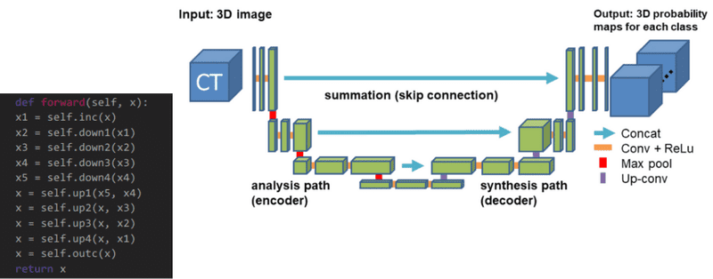

# UNets

A U-shaped architecture consists of a specific encoder-decoder scheme: The encoder reduces the spatial dimensions in every layer and increases the channels. On the other hand, the decoder increases the spatial dims while reducing the channels. The tensor that is passed in the decoder is usually called bottleneck. In the end, the spatial dims are restored to make a prediction for each pixel in the input image. These kinds of models are extremely utilized in real-world applications.

 

## Different Methods of creating the architecture

 

### Method 1
---
~~~

class UNet(nn.Module):

    def __init__(self, input_channel, retain=True):

        super().__init__()
        self.conv1 = Convblock(input_channel, 32)
        self.dconv1 = Downconv(32, 32)
        self.conv2 = Convblock(32, 64)
        self.dconv2 = Downconv(64, 64)
        self.conv3 = Convblock(64, 128)
        self.dconv3 = Downconv(128, 128)
        self.conv4 = Convblock(128, 256)
        self.dconv4 = Downconv(256, 256)

        self.neck = nn.Conv2d(256, 512, 3, 1, 1)

        self.upconv4 = Upconv(512, 256, 4, 2, 1, 0)
        self.Dconv4 = Convblock(512, 256)
        self.upconv3 = Upconv(256, 128, 4, 2, 1, 0)
        self.Dconv3 = Convblock(256, 128)
        self.upconv2 = Upconv(128, 64, 4, 2, 1, 0)
        self.Dconv2 = Convblock(128, 64)
        self.upconv1 = Upconv(64, 32, 4, 2, 1, 0)
        self.Dconv1 = Convblock(64, 32)
        self.out = nn.Conv2d(32, 1, 3, 1, 1)
        self.retain = retain
~~~

### Method 2

~~~

class UNet(nn.Module):

    def __init__(self, input_channel, retain=True):

        super().__init__()

        self.conv1 = Convblock(input_channel, 32)
        self.conv1_1 = Convblock(32, 32)
        self.conv2 = Convblock(32, 64)
        self.conv3 = Convblock(64, 128)
        self.conv3_3 = Convblock(128, 128)
        self.conv4 = Convblock(128, 256)
        self.conv4_4 = Convblock(256, 256)
        self.neck = nn.Conv2d(256, 512, 3, 1)
        self.upconv4 = nn.ConvTranspose2d(512, 256, 4, 2, 0, 1)
        self.dconv4 = Convblock(512, 256)
        self.upconv3 = nn.ConvTranspose2d(256, 128, 4, 2, 0, 1)
        self.dconv3 = Convblock(256, 128)
        self.upconv2 = nn.ConvTranspose2d(128, 64, 4, 2, 0, 1)
        self.dconv2 = Convblock(128, 64)
        self.upconv1 = nn.ConvTranspose2d(64, 32, 4, 2, 0, 1)
        self.dconv1 = Convblock(64, 32)
        self.out = nn.ConvTranspose2d(32, 1, 4, 2, 0, 1)
        self.retain = retain

~~~